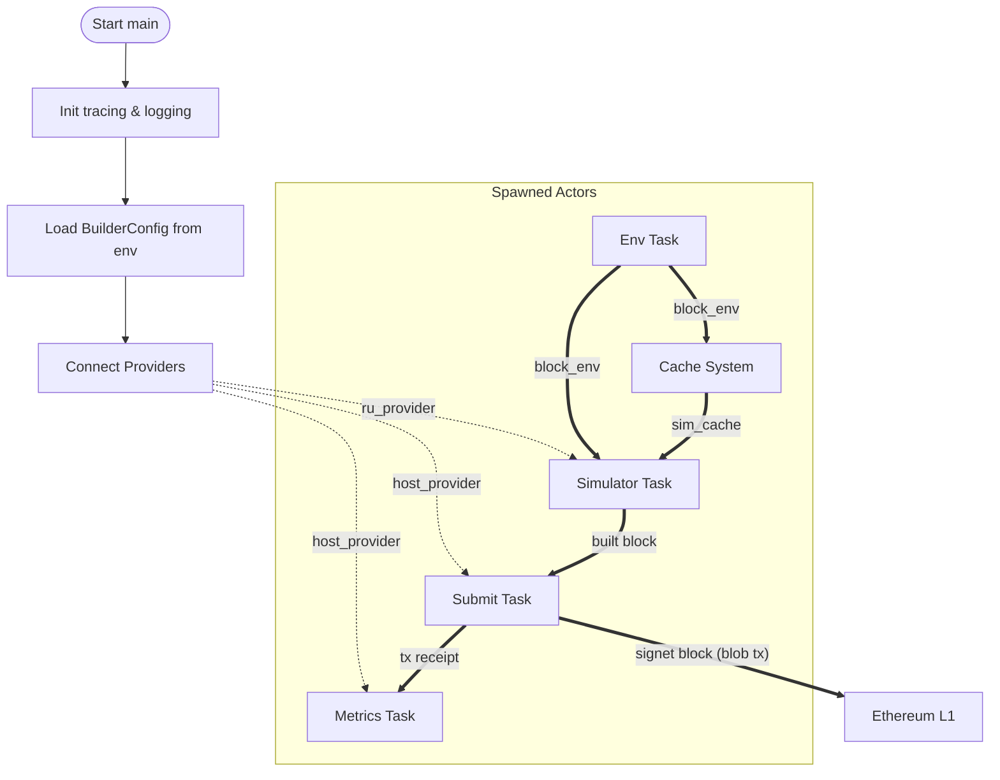

# The Signet Block Builder

The Builder is responsible for transactions through the Signet rollup, from ingestion and simulation to block construction and submission to Ethereum L1.

---

## 🚀 System Design

The Builder orchestrates a series of asynchronous actors that work together to:

1. **Env** - watches the latest host and rollup blocks to monitor gas rates and block updates.
2. **Cache** - polls bundle and transaction caches and adds them to the cache.
3. **Simulator** - simulates transactions against rollup state and block environment to build them into a cohesive block.
5. **Submit** - builds a blob transaction of the built block and sends it to Ethereum L1.
6. **Metrics** - records block and tx data.



---

## ⚙️ Configuration

The Builder is configured via environment variables. The following values are supported for configuration.

| Key                       | Required | Description                                                         |
| ------------------------- | -------- | ------------------------------------------------------------------- |
| `HOST_CHAIN_ID`           | Yes      | Host-chain ID (e.g. `3151908`)                                      |
| `RU_CHAIN_ID`             | Yes      | Rollup-chain ID (e.g. `14174`)                                      |
| `TX_POOL_URL`             | Yes      | Transaction pool URL (must end with `/`)                            |
| `HOST_RPC_URL`            | Yes      | RPC endpoint for the host chain                                     |
| `RU_RPC_URL`              | Yes      | RPC endpoint for the rollup chain                                   |
| `TX_BROADCAST_URLS`       | No       | Additional endpoints for blob txs (comma-separated, slash required) |
| `ZENITH_ADDRESS`          | Yes      | Zenith contract address                                             |
| `BUILDER_HELPER_ADDRESS`  | Yes      | Builder helper contract address                                     |
| `QUINCEY_URL`             | Yes      | Remote sequencer signing endpoint                                   |
| `BUILDER_PORT`            | Yes      | HTTP port for the Builder (default: `8080`)                         |
| `SEQUENCER_KEY`           | Yes      | AWS KMS key ID _or_ local private key for sequencer signing         |
| `BUILDER_KEY`             | Yes      | AWS KMS key ID _or_ local private key for builder signing           |
| `BUILDER_REWARDS_ADDRESS` | Yes      | Address receiving builder rewards                                   |
| `ROLLUP_BLOCK_GAS_LIMIT`  | No       | Override for block gas limit                                        |
| `CONCURRENCY_LIMIT`       | Yes      | Max concurrent tasks the simulator uses                             |
| `SLOT_OFFSET`             | Yes      | Slot timing offset in seconds                                       |
| `SLOT_DURATION`           | Yes      | Slot duration in seconds                                            |
| `START_TIMESTAMP`         | Yes      | UNIX timestamp for slot 0                                           |

---

## 📤 Transaction Sender

A binary (`bin/submit-transaction.rs`) for continously sending very small transactions for testing block construction.

The following values are available for configuring the transaction sender:

| Key                 | Required | Description                                      |
| ------------------- | -------- | ------------------------------------------------ |
| `RPC_URL`           | Yes      | RPC endpoint used for sending the transaction    |
| `RECIPIENT_ADDRESS` | Yes      | Address to which the transaction is sent         |
| `SLEEP_TIME`        | No       | Optional delay (in seconds) between transactions |
| `SIGNER_CHAIN_ID`   | Yes      | Chain ID used for signing                        |
| `SIGNER_KEY`        | Yes      | Signing key used to sign the transaction         |

---

## 🛠️ Development

### Requirements

- **Rust** ≥ 1.85
- **AWS CLI**
- A private key or AWS KMS key for signing transactions

---

## ✅ Testing

1. Build the Docker image:
   ```bash
   docker build -t builder:latest .
   ```
2. Push to your container registry:
   ```bash
   docker push <registry>/builder:latest
   ```
3. Update your deployment manifests with the new image.
4. Verify expected behavior in your target network.
   - This should typically include sending a test transaction and verifying it is simulated and built into a block.
  
## 🪪 License

This project is licensed under the [MIT License](https://opensource.org/licenses/MIT).
