# The Signet Block Builder

The Builder simulates bundles and transactions against the latest chain state to create valid Signet rollup blocks and submits them to the configured host chain as an [EIP-4844 transaction](https://github.com/ethereum/EIPs/blob/master/EIPS/eip-4844.md).

Bundles are treated as Flashbots-style bundles, meaning that the Builder should respect transaction ordering, bundle atomicity, and the specified revertability.

--------------------------------------------------------------------------------

## 🚀 System Design

The Builder orchestrates a series of asynchronous actors that work together to build blocks for every assigned slot.

1. **Env** - watches the latest host and rollup blocks to monitor gas rates and block updates.
2. **Cache** - polls bundle and transaction caches and adds them to the cache.
3. **Simulator** - simulates transactions and bundles against rollup state and block environment to build them into a cohesive block.
4. **Submit** - creates a blob transaction from the built block and sends it to the configured submit task.

  1. Flashbots - builds a Flashbots bundle out of the Signet block which contains Signet transactions, host transactions, and host fills, and submits it to the configured Flashbots endpoint.
  2. Builder Helper - builds a transaction call with the builder helper contract and submits that as a transaction.

5. **Metrics** - records block and tx data over time.

```mermaid
%%{ init : { "theme" : "dark" } }%%
flowchart TD
   %% Initialization
   Start(["Start"]) --> Init["Init tracing & logging"]
   Init --> Config["Load BuilderConfig from env"]

   Inbound["📥 Transactions &
   📦 Bundles"] --> Cache["🪏 Cache Task"]
   Quincey["🖊️ Quincey (Signer)"]

   %% Block building loop
   subgraph BuilderLoop["Block Building Loop"]
      Env["🔢 Env Task"]
      Cache["🪏 Cache Task"]
      Simulator["💾 Simulator Task"]
      Metrics["📏 Metrics Task"]

      %% Decision: route to Flashbots or Builder Helper
      FB@{ shape: hex, label: "FLASHBOTS_ENDPOINT\nconfigured?" }
      FB --> | Yes | FlashbotsSubmit["⚡🤖 Flashbots Submit"]
      FB --> | No  | HelperSubmit["🏗️ Builder Helper Submit"]

   end

   %% Signing
   FlashbotsSubmit -- block hash --> Quincey
   Quincey -- block signature --> FlashbotsSubmit
   HelperSubmit -- block hash --> Quincey
   Quincey -- block signature --> HelperSubmit

   %% Config wiring
   Config -.rollup rpc.-> Env
   Config -.host rpc.-> Simulator
   Config -.host rpc.-> Metrics

   %% Core flow
   Env ==block_env==> Simulator
   Cache ==sim_cache==> Simulator
   Simulator ==built_block==> FB 

   FlashbotsSubmit -->|"bundle"| FlashbotsRelay["🛡️ Flashbots Relay"]
   FlashbotsRelay --> Ethereum
   HelperSubmit -->|"blob tx"| Ethereum["⛓️ Ethereum L1"]

   %% Metrics
   FlashbotsSubmit ==bundle hash==> Metrics
   HelperSubmit ==tx hash==> Metrics

   class FlashbotsRelay,Ethereum ext
```



### Simulation Task

The block building loop waits until a new block environment has been received, and then kicks off the next attempt.

When the Builder receives a new block, it takes a reference to the transaction cache, calculates a simulation deadline for the current slot with a buffer of 1.5 seconds, and begins constructing a block for the current slot.

Transactions enter through the cache, and then they're sent to the simulator, where they're run against the latest chain state and block environment. If they're successfully applied, they're added to the block. If a transaction fails to be applied, it is simply ignored.

When the deadline is reached, the simulator is stopped, and all open simulation threads are cancelled. The built block is then bundled with the block environment and the previous host header that it was simulated against, and all three are passed along to the submit task.

### Submit Task

If Flashbots endpoint has been configured the Flashbots submit task will prepare a Flashbots bundle out of that Signet block, and then submits that bundle to the Flashbots endpoint.

If a Flashbots endpoint has _not_ been configured, the Builder will create a raw contract call and submits the transaction to the default mempool. This mode of operation is only for testing on private networks and should not be used in production, since it can leak sensitive transaction data from the Signet block.

If the block received from simulation is empty, the submit task will ignore it.

Finally, if it's non-empty, the submit task attempts to get a signature for the block, and if it fails due to a 403 error, it will skip the current slot and begin waiting for the next block.

--------------------------------------------------------------------------------

## ⚙️ Configuration

The Builder is configured via environment variables. The following values are supported for configuration.

Key                           | Required | Description
----------------------------- | -------- | ----------------------------------------------------------------------
`HOST_CHAIN_ID`               | Yes      | Host-chain ID (e.g. `3151908`)
`RU_CHAIN_ID`                 | Yes      | Rollup-chain ID (e.g. `14174`)
`HOST_RPC_URL`                | Yes      | RPC endpoint for the host chain
`ROLLUP_RPC_URL`              | Yes      | RPC endpoint for the rollup chain
`TX_POOL_URL`                 | Yes      | Transaction pool URL (must end with `/`)
`TX_BROADCAST_URLS`           | No       | Additional endpoints for blob txs (comma-separated, slash required)
`FLASHBOTS_ENDPOINT`          | No       | Flashbots API to submit blocks to.
`ZENITH_ADDRESS`              | Yes      | Zenith contract address
`BUILDER_HELPER_ADDRESS`      | Yes      | Builder helper contract address
`QUINCEY_URL`                 | Yes      | Remote sequencer signing endpoint
`BUILDER_PORT`                | Yes      | HTTP port for the Builder (default: `8080`)
`SEQUENCER_KEY`               | Yes      | AWS KMS key ID _or_ local private key for sequencer signing
`BUILDER_KEY`                 | Yes      | AWS KMS key ID _or_ local private key for builder signing
`BUILDER_REWARDS_ADDRESS`     | Yes      | Address receiving builder rewards
`ROLLUP_BLOCK_GAS_LIMIT`      | No       | Override for block gas limit
`CONCURRENCY_LIMIT`           | No       | Max concurrent tasks the simulator uses
`OAUTH_CLIENT_ID`             | Yes      | Oauth client ID for the builder
`OAUTH_CLIENT_SECRET`         | Yes      | Oauth client secret for the builder
`OAUTH_AUTHENTICATE_URL`      | Yes      | Oauth authenticate URL for the builder for performing OAuth logins
`OAUTH_TOKEN_URL`             | Yes      | Oauth token URL for the builder to get an Oauth2 access token
`AUTH_TOKEN_REFRESH_INTERVAL` | Yes      | The OAuth token refresh interval in seconds.
`CHAIN_NAME`                  | No       | The chain name ("pecorino", or the corresponding name)
`SLOT_OFFSET`                 | No       | Slot timing offset in seconds. Required if `CHAIN_NAME` is not present
`SLOT_DURATION`               | No       | Slot duration in seconds. Required if `CHAIN_NAME` is not present
`START_TIMESTAMP`             | No       | UNIX timestamp for slot 0\. Required if `CHAIN_NAME` is not present

--------------------------------------------------------------------------------

## 💻 Recommended Specs

Key    | Minimum  | Recommended
------ | -------- | -----------
CPU    | 0.1 vCPU | 0.5 vCPU
Memory | 256MB    | 512MB

**Note: Builder prefers clock speed over core count, recommended 2.8Ghz+**

--------------------------------------------------------------------------------

## 💾 EVM Behavior

### 🗿 Inherited Header Values

`PREVRANDAO` is set to a random byte string for each block.

```rust
// `src/tasks/env.rs`
prevrandao: Some(B256::random()),
```

`TIMESTAMP` - Block timestamps are set to the same value as the current Ethereum block.

Blob gas values `excess_blob_gas` and `blob_gasprice` are also set to 0 for all Signet blocks.

### 🔢 Disabled Opcodes

`BLOBHASH` - EIP-4844 is not supported on Signet. `BLOBBASEFEE` - EIP4844 is not supported.

## ⛽ Transaction Submission

When a completed, non-empty Signet block is received by the Submit task, it prepares the block data into a blob transaction and submits it to the network.

If it fails, it will retry up to 3 times with a 12.5% bump on each retry.

The previous header's basefee is tracked through the build loop and used for gas estimation purposes in the Submit Task.

## 🛠️ Development

### Requirements

- **Rust** ≥ 1.85
- **AWS CLI**
- A private key or AWS KMS key for signing transactions

--------------------------------------------------------------------------------

## ✅ Testing

1. Build the Docker image:

  ```bash
  docker build -t builder:latest .
  ```

2. Push to your container registry:

  ```bash
  docker push <registry>/builder:latest
  ```

3. Update your deployment manifests with the new image.

4. Verify expected behavior in your target network.

  - This should typically include sending a test transaction and verifying it is simulated and built into a block.

## 🪪 License

This project is licensed under the [MIT License](https://opensource.org/licenses/MIT).
